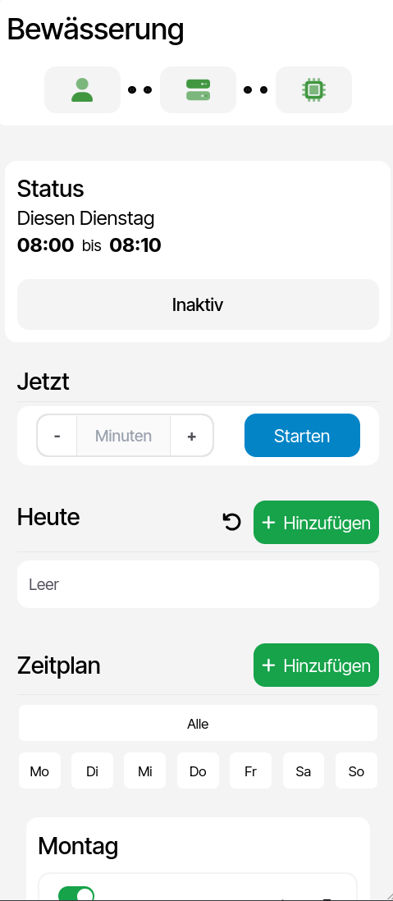
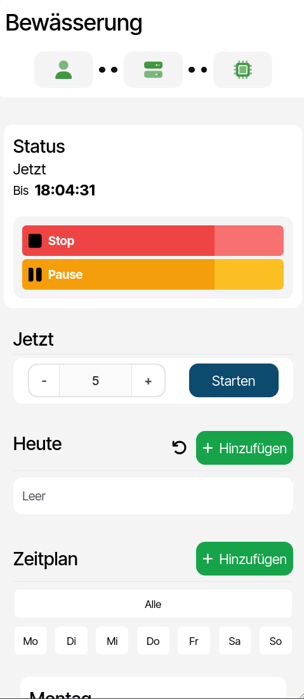

# H2OS - Home Watering System

H2OS is a DIY smart watering system for your home, because buying premade solutions is lame.

It also supports water detection with push notifications via `ntfy`

> [!IMPORTANT]
> User interface is currently only in German!

## Getting started

Minimum requirements for the project:

- An ESP32 (or any other micro controller with network capabilities)
- A Server
- Hardware to control the water flow, for example an electric valve

### 1. Clone the repo

   ```bash
   git clone ...
   ```

### 2. Configure

1. Copy the `./esp/esp.template.h` file as `./esp/esp.h` 

    ```bash
    cp ./esp/esp.template.h ./esp/esp.h
    ```

    Then change the header file for the ESP32 (`./esp/esp.h`)

    ```c
    #define WIFI_SSID "wifi-ssid"
    #define WIFI_PASSWD "wifi-password"
    #define WIFI_HOSTNAME "esp32-watering"
    
    // #define USE_SENSOR 			 	// Uncomment if you want to use the sensor
    
    #define NTP_SERVER "ntp-server" 	// for example: europe.pool.ntp.org
    #define TIMEZONE_INFO "timezone" 	// for example: CET-1CEST,M3.5.0,M10.5.0/3
    
    #define PUMP_PIN 25					// change if necessary
    #define SENSOR_PIN 16				// change if necessary
    
    #define SERVER_IP "server-ip"
    ```

2. Copy the `src/main/resources/application.template.properties` file as `src/main/resources/application.properties`

   ```bash
   cp src/main/resources/application.template.properties src/main/resources/application.properties
   ```

   Then change the `application.properties` for the Spring server, if you don't use `ntfy`, you can leave it as is

    ```properties
    ntfy.url="ntfy-pve"		
    ntfy.topic="watering"
    ```

3. Finally update the server URL for the website (`src/main/resources/static/exports.js`)

    ```js
    const SERVER_URL = "server-ip";
    ```

### 3. Compile changes

Compile changes into a `.jar` file

On Linux

```bash
./mvnw clean compile package
```

On Windows

```bash
./mvnw.cmd clean compile package
```

### 4. Flash & Run

#### Flash the ESP32

Flash the ESP via the Arduino-IDE

> You may have to install the ESP-Board library, and the `ESP32Time.h` library

#### Server, via Docker-Compose (recommended)

Change the `TZ=<...>` field in the `./docker-compose.yml` file to match your timezone 

Then build the image and start the container with `docker compose`

```bash
docker compose up -d
```

Check status with `docker compose logs`

```bash
docker compose logs
```

Stop with `docker compose stop`

```bash
docker compose stop
```

#### Server, otherwise

1. Create the logging directory

   ```bash
   mkdir -p ./volume/logs
   ```

2. Create the `schedule.data` file
   
    ```bash
    touch ./volume/schedule.data
    ```

3. Run the Server program

   ```bash
   java -jar ./h2os-x.x.x.jar
   ```

#### Done!

In your Browser go to your server at port `8080` (or whatever you have set), you should see the website.

<html>

<div style="display: flex; flex-direction: row; justify-content: space-around;">
    
    
</div>

<hr>

<div style="display: flex; flex-direction: row; justify-content: space-around;">
    
    
</div>


</html>
